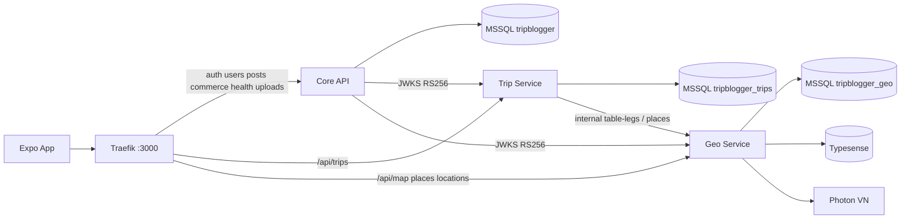

# Architecture

## Topology

## Request paths

**Search:** App `GET /api/map/search` → Traefik → Geo `SearchService` → Typesense (fallback SQL `normalized_name`) → `rankPlaces` → `MapPlaceDto[]`.

**Create stop:** App `POST /api/trips/:id/stops` → Trip `TripsService` → snapshot place → `GeoRoutingClient.tableLegs` → schedule via `@tripblogger/itinerary-engine`.

## Events (Redis Streams)

| Stream | Types | Publisher |
|--------|-------|-----------|
| `place.events` | `place.created`, `place.updated`, `place.approved` | Geo outbox (package `@tripblogger/events`) |
| `trip.events` | `trip.created`, `trip.updated` | Trip (ready; poller optional) |
| `user.events` | `user.status.changed` | Core (hook when statuses change) |

## Databases

| Database | Owner | Writers |
|----------|-------|---------|
| `tripblogger` | Core | Core only |
| `tripblogger_trips` | Trip | Trip only (`user_id` opaque) |
| `tripblogger_geo` | Geo | Geo only |

## Auth

Access JWT: RS256 when `JWT_ACCESS_PRIVATE_KEY_PATH` is set, else HS256. Payload `{ sub, role, statuses, iss: tripblogger-core }`. JWKS at `GET /api/auth/.well-known/jwks.json`. Trip/Geo verify via `@tripblogger/auth` (RS256 then HS256 fallback). Refresh tokens remain HS256 on Core only.
