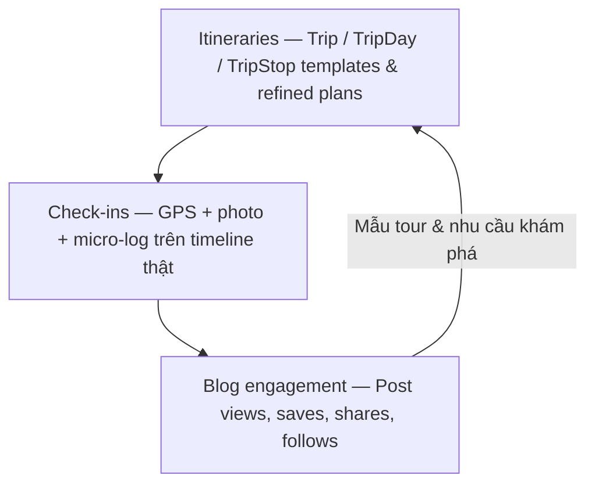
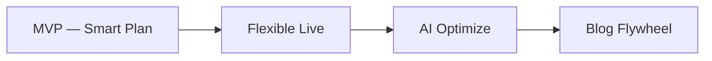

# TripBlogger Trip — Investor Brief

> **Audience:** Investors, advisors, strategic partners  
> **Language:** Vietnamese-first; English headings for scanability  
> **Pitch spine:** Problem → Solution → Benefit (Plan → Track → Publish)  
> **Disclaimer:** Không có KPI vận hành thật trong tài liệu này. Mọi con số mang tính **giả định / ví dụ minh họa** đều được đánh dấu rõ.

---

## 1. Investment Narrative — Problem → Solution → Benefit

### Problem

Self-planners nội địa (đặc biệt lần đầu / infrequent) đang kẹt giữa hai cực:

- **OTA / marketplace** tối ưu giao dịch booking — mỏng về “sống” lịch trình khi contingency xảy ra.  
- **Diary apps** tối ưu viết sau chuyến — yếu về tạo tour chạy được và cứu plan khi đang đi.

Hệ quả với người dùng: **lo trước chuyến**, **mất thời gian khi plan vỡ**, **trang trắng sau chuyến**. Notes + Maps + chat nhóm không tạo vòng khép kín — và không tạo dữ liệu compounding cho nền tảng.

### Solution

**TripBlogger chiếm vị trí “operating system của chuyến đi tự túc”** — không phải diary app, cũng không phải OTA.

Người dùng tạo **Trip** như tour chuyên nghiệp đã đơn giản hóa, sống cùng Trip khi contingency xảy ra, rồi biến hành trình thành **Post** (blog/feed sẵn có) bằng một thao tác. Vòng **Plan → Track → Publish** vừa giải nỗi đau người dùng, vừa tạo dữ liệu mà marketplace thuần booking và diary thuần cảm xúc khó sao chép cùng lúc.

### Benefit — vì sao người dùng ở lại (và vì sao đáng đầu tư)

| Lợi ích người dùng | Ý nghĩa kinh doanh |
|--------------------|--------------------|
| **Bớt lo** khi lần đầu — template + POI featured | Wedge rõ, activation dễ kể chuyện |
| **Tiết kiệm thời gian** — không dựng lại plan khi đang đi | Retention gắn contingency thật |
| **Plan sống sót hỗn loạn** — Quick Swap / re-route | Differentiator vs diary & OTA |
| **Blog không trang trắng** — 1-click Post + map | Organic distribution qua feed đã có |

**Câu chuyện thương hiệu:** TripBlogger = nền tảng nội dung du lịch (Post, feed, explore) + Trip làm trung tâm trước/trong/sau chuyến. Trip không phải module phụ; Trip là cách người dùng **nhận lợi ích** rồi **xuất bản** lại vào mạng nội dung của app.

---

## 2. Market Wedge

### Wedge ban đầu (điểm vào)

| Trục | Lựa chọn wedge | Lý do (pain → payoff) |
|------|----------------|------------------------|
| **Persona** | First-time / infrequent self-planners | Đau rõ: thiếu kinh nghiệm + ngại viết lại → lợi ích “bớt lo + blog một chạm” dễ cảm |
| **Địa bàn** | Điểm đến nội địa phổ biến (vd. Đà Lạt, Phú Quốc) | Template curated & POI featured dễ làm dày; contingency dễ minh họa |
| **Job-to-be-done** | “Cho tôi lịch trình chạy được — đừng bắt tôi viết blog từ đầu” | Khác OTA (book) và khác diary (viết) |

### Không cạnh tranh frontally (giai đoạn wedge)

- Không cố trở thành booking marketplace trước.
- Không cố thay Google Maps / Apple Maps cho chỉ đường thuần túy.
- Không tối ưu cho travel agent enterprise trước khi loop consumer chạy.

### Mở rộng tự nhiên sau wedge

Nội dung Post từ Trip thật → discovery → tái sử dụng pattern lịch trình → nhu cầu template / tối ưu AI / (sau này) đối tác địa phương theo **ngữ cảnh lịch trình**, không chỉ theo banner quảng cáo.

---

## 3. Moat — Data & Flywheel

Moat không dựa trên “có map” hay “có feed” đơn lẻ, mà trên **ba lớp dữ liệu gắn nhau** — mỗi lớp gắn với lợi ích người dùng đã sống:

| Lớp dữ liệu | Lợi ích user tạo tín hiệu | Vì sao khó copy nhanh |
|-------------|---------------------------|------------------------|
| **Itineraries** | Bớt lo — lịch “chạy được” | Học được “tour nào chạy được”, không chỉ POI list |
| **Check-ins** | Plan sống sót — plan vs reality | Dữ liệu contingency — vàng cho tối ưu live |
| **Blog engagement** | Không trang trắng — Post được đọc / lưu | Đóng vòng discovery → tạo Trip mới |

**Giả định chiến lược (chưa phải metric báo cáo):** mỗi Trip hoàn thành có check-in + 1 Post sẽ vừa **huấn luyện** chất lượng template, vừa **marketing** organic qua feed — hai việc cùng một hành vi người dùng.

---

## 4. Monetization Options (high-level, realistic)

Ưu tiên các mô hình **không phá** lợi ích cốt lõi (bớt lo, sửa nhanh, blog nhẹ) và không biến Trip thành tường quảng cáo.

| Hướng | Giá trị với user | Giai đoạn hợp lý |
|-------|------------------|------------------|
| **Premium Trip tools** | Lên kế hoạch & xuất Post mượt hơn (template nâng cao, OCR/NLP ưu tiên, tối ưu cụm) | Sau khi MVP loop được yêu thích |
| **Destination / partner placement** | Gợi ý POI / chỗ ở có ngữ cảnh lịch trình (minh bạch) | Khi có đủ Trip + check-in theo điểm đến |
| **Creator / pro lite** | Khung tour + publish cho người làm nội dung nghiệp dư | Khi flywheel Post đã rõ |
| **Affiliate nhẹ (tuỳ chọn)** | Deep-link đặt chỗ ngoài — Trip vẫn là planner/tracker | Chỉ khi không làm vỡ UX contingency |

**Không đề xuất sớm:** paywall chặn check-in cơ bản; spam deal trong timeline đang ACTIVE.

*(Doanh thu mục tiêu / ARPU: **TBD — giả định sẽ bổ sung sau discovery với số liệu thật**.)*

---

## 5. Risks & Mitigations

| Rủi ro | Tác động | Mitigation |
|--------|----------|------------|
| Bị nhận diện như “diary app nữa” | Sai định vị, CAC cao | Messaging nhấn **lợi ích:** bớt lo → plan sống sót → blog một chạm (Tour Creator, không diary-first) |
| Contingency UX phức tạp | User bỏ khi plan vỡ | Quick Swap, drag-drop, tối thiểu tap — đo “time-to-reroute” |
| Cold start template / POI | Auto-cook kém → mất lợi ích “bớt lo” | Wedge ít điểm đến; **MVP = template curated + POI featured** trước khi mở rộng |
| Phụ thuộc Places API trả phí sớm | Burn cash trước product-market fit | **Hoãn / free-tier** khi chưa publish rộng; ưu tiên trải nghiệm founder thật trước scale API *(ghi chú vận hành, không phải hero của pitch)* |
| Blog assemble chất lượng thấp | Post không đáng publish | Micro-log có cấu trúc nhẹ; map itinerary làm xương sống bài |
| Mở rộng commerce/booking quá sớm | Phân tán focus | Giữ wedge Plan–Track–Publish; partner placement sau |

---

## 6. Roadmap Phases

| Phase | Tên | Lợi ích người dùng (kết quả) | Ghi chú phạm vi |
|-------|-----|------------------------------|-----------------|
| **1** | **MVP — Smart Plan** | Bớt lo — có lịch chạy được nhanh | Template **curated** + POI **featured**; chỗ ở placeholder + preference; gắn Trip hiện có. Places API scale: free-tier / hoãn |
| **2** | **Flexible Live** | Plan sống sót — sửa nhanh khi contingency | ACTIVE timeline; 1-tap GPS check-in; Quick Swap; re-route drag-drop |
| **3** | **AI Optimize** | Tiết kiệm thời gian sâu hơn khi tạo & tối ưu tour | NLP một câu; OCR vé; tối ưu cụm tuyến — sau khi có tín hiệu plan vs check-in |
| **4** | **Blog Flywheel** | Không trang trắng — Post một chạm + discovery | Assemble Post + itinerary map; Post → Trip mới |

Thứ tự cố ý: **đừng** đẩy AI/blog flywheel trước khi live contingency đủ mượt — đó là điểm khác diary và nơi lợi ích “plan sống sót” được chứng minh.

---

## 7. Ask / Next Steps

> Các mục dưới đây là **placeholder chuyên nghiệp** — điền số liệu / điều khoản khi sẵn sàng.

### Ask (điền sau)

- **Vốn / runway cần:** `[TBD]`  
- **Use of funds (gợi ý cấu trúc):** sản phẩm Trip loop (Plan–Track–Publish) · seed template/POI điểm đến wedge · tăng trưởng nội địa có kiểm soát · đội ngũ mobile + content ops *(Places API trả phí scale sau khi trải nghiệm & publish sẵn sàng — không phải hạng mục hero sớm)*  
- **Mốc 12–18 tháng (ví dụ định tính, không phải cam kết số):** hoàn thành Phase 1–2 trên wedge địa bàn; chứng minh tỷ lệ Trip → check-in → Post; sẵn sàng Phase 3 có dữ liệu thật  

### Next steps đề xuất với đối tác / investor

1. Demo narrative 10–12 phút theo [trip-pitch-deck-outline.md](./trip-pitch-deck-outline.md) — mở bằng pain → payoff  
2. Thống nhất wedge điểm đến + persona cho MVP (template curated + POI featured)  
3. Đồng bộ vision này với đặc tả kỹ thuật nội bộ (`docs/TRIP_FEATURE_SPEC.md`) — vision dẫn dắt ưu tiên, không thay spec  
4. Thiết lập dashboard giả định → thay bằng metric thật: Trip tạo → ACTIVE → check-in → Post publish  
5. Lịch deep-dive sản phẩm / data moat: `[ngày TBD]`

---

## 8. Closing line

TripBlogger không xin vốn để “làm thêm một app viết nhật ký”.  
TripBlogger giải **nỗi đau thật** của self-planner — lo trước, loạn khi đi, trống sau chuyến — bằng vòng **Plan → Track → Publish**, và biến mỗi chuyến đi thành dữ liệu + nội dung tái tạo tăng trưởng.
