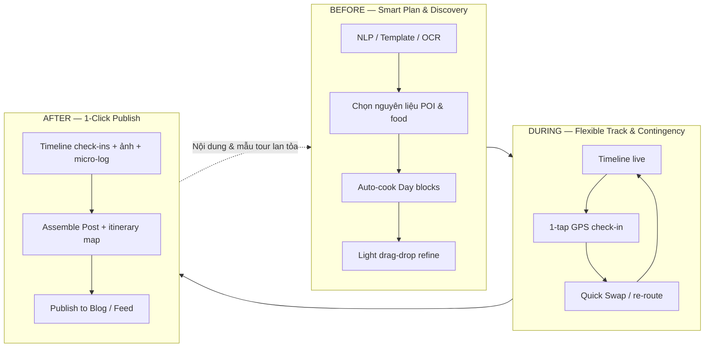

# TripBlogger Trip — Product Vision Overview

> **Audience:** Business stakeholders, partners, early customers  
> **Language:** Vietnamese-first (English section titles for investor readability)  
> **Scope:** Product vision for the **Trip** feature — not a technical implementation spec  
> **Related product surfaces:** Trip (planner + live track) → **Post** (blog/feed đã có trong app)  
> **Pitch spine:** Problem → Solution → Benefit (Plan → Track → Publish)

---

## 1. Executive Summary — Problem → Solution → Benefit

### Problem

Người đi lần đầu (Đà Lạt, Phú Quốc…) thường gặp cùng lúc ba nỗi đau:

1. **Thiếu kinh nghiệm** — không biết chọn gì, xếp ngày thế nào; copy lịch mạng rồi vẫn rối.  
2. **Kế hoạch vỡ ngoài đời** — đóng cửa, mưa, overbook; chỉnh lại bằng tay trên nhiều app mất thời gian và tăng lo.  
3. **Ghét viết blog từ đầu** — ảnh nằm trong máy, kỷ niệm phân mảnh; hầu như không thành bài để chia sẻ.

Công cụ hiện tại (Notes + Maps + chat nhóm) **không khép vòng**: không giảm lo trước chuyến, không cứu kế hoạch khi đang đi, không giúp publish sau chuyến.

### Solution

**TripBlogger Trip** không phải app nhật ký trước. Trip là công cụ **tạo tour / lịch trình chuyên nghiệp**, đơn giản hóa cho người dùng phổ thông — kết hợp theo dõi linh hoạt khi đang đi, rồi xuất blog một thao tác sang bề mặt Post sẵn có.

> **Trước chuyến:** lên kế hoạch thông minh & khám phá → **Trong chuyến:** theo dõi linh hoạt & xử lý contingency → **Sau chuyến:** publish blog 1-click.

### Benefit — lợi ích mang lại cho người dùng

| Nỗi đau | Lợi ích cảm nhận được |
|---------|------------------------|
| Thiếu kinh nghiệm | **Bớt lo khi lần đầu** — có khung tour chạy được, không phải tự xây từ zero |
| Kế hoạch vỡ | **Kế hoạch sống sót khi hỗn loạn** — đổi điểm / tuyến nhanh, không lập lại từ đầu |
| Ghét viết lại | **Blog không còn trang trắng** — bài Post lắp từ check-in đã sống trên đường |
| Nhảy nhiều app | **Tiết kiệm thời gian** — plan, track, publish trên một vòng sản phẩm |

**One-liner:** TripBlogger Trip giúp bạn có lịch trình chạy được, chỉnh nhanh khi thực tế đổi, và có bài đẹp sau chuyến — mà không cần trở thành planner hay writer chuyên nghiệp.

---

## 2. Why Now & MVP realism (nhẹ)

- Người dùng đã quen **feed + map + check-in** trên mobile; kỳ vọng là “ít bước, kết quả rõ”.
- TripBlogger đã có bề mặt **Post / feed / explore** và nền tảng Trip — vòng **Plan → Track → Publish** neo vào sản phẩm thật.
- Du lịch nội địa vẫn cần công cụ **lịch trình linh hoạt**, không chỉ booking chỗ ngồi giữa marketplace.

**Roadmap content (thực tế giai đoạn đầu):** MVP ưu tiên **template được chọn lọc + POI nổi bật (featured)** theo điểm đến wedge — đủ dày để người lần đầu tin và dùng được, trước khi mở rộng catalog.

**Dữ liệu Places bên thứ ba:** API Places quy mô lớn **hoãn / chỉ free-tier** khi app chưa publish rộng; founder ưu tiên **trải nghiệm cá nhân thật, chắc** trước khi chi cho API scale. *(Ghi chú vận hành — không phải điểm bán chính của pitch.)*

*(Không có số liệu thị trường giả trong tài liệu này; xem investor brief cho giả định đánh dấu rõ.)*

---

## 3. Product Loop

| Giai đoạn | Người dùng nhận được gì |
|-----------|-------------------------|
| **BEFORE** | Khung tour từ template / câu NLP; chọn nguyên liệu; hệ thống xếp Day blocks — **bắt đầu nhanh, bớt lo** |
| **DURING** | Check-in nhẹ + Quick Swap / kéo-thả — **kế hoạch không chết khi contingency** |
| **AFTER** | Post + itinerary map một chạm — **chia sẻ / lưu giữ không ngồi viết lại** |

**Flywheel ý tưởng (định tính):** Trip hoàn thành → Post chất lượng → người khác khám phá / tái dùng pattern lịch trình → tạo Trip mới dễ hơn.

---

## 4. Differentiator

### So với diary / nhật ký du lịch apps

| Diary-first | TripBlogger Trip — lợi ích |
|-------------|----------------------------|
| Ghi lại sau khi đã đi (hoặc ghi rời rạc) | **Tạo tour trước**, sống chuyến đi, blog là đầu ra tự nhiên |
| Viết tay / chọn ảnh thủ công là trung tâm | **Không còn trang trắng** — blog lắp từ check-in |
| Ít hỗ trợ contingency ngoài đời | **Kế hoạch sống sót** nhờ Quick Swap / kéo-thả |
| Lịch trình thường là phụ lục | Lịch trình là **xương sống** trải nghiệm |

### So với booking marketplaces

| Marketplace | TripBlogger Trip — lợi ích |
|-------------|----------------------------|
| Tối ưu **giao dịch** (phòng, vé, combo) | Tối ưu **thiết kế & vận hành lịch trình** — người dùng tự tin đi |
| Chỗ ở / sản phẩm là SKU bán | Chỗ ở là **placeholder + preference**; không bắt book trong vòng Plan–Track–Publish |
| Sau khi book, trải nghiệm “trong chuyến” mỏng | **Sửa nhanh khi đang đi** là phần sản phẩm chính |
| Nội dung UGC thường là review rời | **1-click Post** gắn itinerary map — nội dung gắn chuyến đi thật |

TripBlogger có thể đồng hành với (không thay thế) công cụ booking: người dùng lên lịch & sống chuyến đi trên Trip; đặt chỗ ở kênh họ quen nếu muốn.

---

## 5. Target Users

| Nhóm | Nỗi đau | Lợi ích Trip mang lại |
|------|---------|------------------------|
| **First-time travelers** (vd. Đà Lạt / Phú Quốc lần đầu) | Không biết bắt đầu từ đâu | Template curated + POI nổi bật → lịch chạy được, **bớt lo** |
| **Nhóm bạn / cặp đôi tự túc** | Plan dễ vỡ khi đang đi | Đổi tuyến nhanh — **tiết kiệm thời gian & bớt căng** |
| **Người thích chia sẻ nhưng ngại viết** | Trang trắng sau chuyến | Auto-assemble Post từ timeline |
| **Creator / blogger du lịch nghiệp dư** | Muốn khung tour chuyên nghiệp, không spreadsheet | 3-step creator + map itinerary trong Post |

**Không phải đối tượng ưu tiên của vision này:** người chỉ cần một nút “book combo”; hoặc người chỉ muốn diary text dài không gắn lịch trình.

---

## 6. UX Principle & Creator Flow (tóm tắt)

**Nguyên tắc:** minimize operations — mỗi thao tác phải đổi thành lợi ích cảm nhận được (nhanh hơn, ít lo hơn, plan không chết, blog không trống).

| Thao tác gọn | Lợi ích |
|--------------|---------|
| NLP / template tạo khung | Bắt đầu trong phút, không tự thiết kế tour |
| OCR quét vé liên quan chuyến | Ít nhập tay |
| One-tap GPS check-in | Ghi nhận chuyến đi thật mà không viết nhật ký dài |
| Drag-drop bucket → timeline; Quick Swap | Contingency không thành khủng hoảng |
| Auto-cook Day blocks theo địa lý & giờ mở cửa | Lịch “chạy được” thay vì list POI loạn |

**3-step creator flow**

1. **Frame tour** — điểm đến, số ngày, style  
2. **Pick ingredients** — thêm POI / ẩm thực khớp style (MVP: ưu tiên POI featured + template curated)  
3. **Auto-cook** — hệ thống xếp Day 1/2/3; user chỉnh nhẹ bằng kéo-thả  

---

## 7. One-liner (pitch sẵn)

> **TripBlogger Trip:** bớt lo trước chuyến, kế hoạch sống sót khi đang đi, blog một chạm sau chuyến — công cụ tạo tour đơn giản cho mọi người, không phải diary app.
