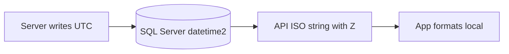

# Time, Hashtags & Interaction Feedback — Design Spec

**Date:** 2026-05-19  
**Status:** Approved in chat (user: "ok")  
**Related:** Wave 1 post/social; extends composer and cross-app UX.

---

## Goals

1. **Time:** Store UTC in database/API; display local time (Vietnam when device is UTC+7) in the app. SSMS showing UTC is expected, not a bug.
2. **Hashtags:** `#Travel`-style tags as rounded chips with auto-commit on boundary; persist in `tags[]` and append to `contentHtml` on save/publish.
3. **Interaction feedback:** App-wide consistent micro-animations so users know an action succeeded (or failed).

---

## Decisions (locked)

| Topic | Decision |
|-------|----------|
| Timezone | UTC in DB/API; local display in UI |
| Tag storage | `tags[]` metadata **and** append hashtag block to end of `contentHtml` when publishing (and on save if status is PUBLISHED) |
| Animation scope | App-wide via shared primitives; phased rollout by screen area |

---

## 1. Time & timestamps

### Problem

User commented at ~10:50–10:53 local (VN); SQL Server showed `2026-05-19 03:51:03` — exactly UTC (VN − 7h). Not a failed insert.

### Architecture



### Backend

- Keep `@CreateDateColumn` / `GETUTCDATE()` defaults; no switch to local wall-clock in DB.
- **Audit** all serializers (`posts.service`, `orders.service`, etc.): `createdAt` / `updatedAt` must use `.toISOString()` (includes `Z`).
- If TypeORM returns Date without timezone from driver, normalize in one helper before JSON response.

### App

- Add [`tripblogger_app/src/utils/datetime.ts`](tripblogger_app/src/utils/datetime.ts):
  - `formatLocalDateTime(iso: string): string` → `dd/mm/yyyy, hh:mm` (device locale).
  - `formatRelativeTime(iso: string): string` → existing rules: &lt;1m "Bây giờ", minutes, hours, days, months, years (reuse/centralize from `CommentThread`).
- Replace ad-hoc `formatDateTime` / `formatRelativeMinutes` in posts, comments, orders where timestamps are shown.
- **i18n:** Relative strings via existing `t()` keys where possible.

### Admin / debugging

- README or internal note: SSMS values are UTC; subtract 7h for VN or use `AT TIME ZONE` in ad-hoc queries.

### Acceptance

- Comment at 10:50 VN shows "Bây giờ" or "10:50" on device set to VN timezone.
- API response contains `2026-05-19T03:50:xx.xxxZ` form.
- No regression for cursor pagination (still ISO-based).

---

## 2. Hashtag tags

### Rules

| Rule | Detail |
|------|--------|
| Prefix | User types `#`; stored value omits `#` in `tags[]` |
| Body | `[A-Za-z0-9_]` only, no spaces inside one tag |
| Examples valid | `#Travel`, `#Food`, `#XuHuong` |
| Commit trigger | Space, Enter, blur of tag segment, or invalid character ends current tag → chip |
| Chip UI | Rounded pill, label `#Travel`, remove (×) |
| Dedupe | Case-insensitive dedupe when committing (`Travel` vs `travel`) |
| Max | 30 tags per post (config constant); max 32 chars per tag |

### Component: `HashtagChipInput`

**Location:** [`tripblogger_app/src/components/posts/HashtagChipInput.tsx`](tripblogger_app/src/components/posts/HashtagChipInput.tsx)

**Props:**

```typescript
type HashtagChipInputProps = {
  tags: string[];
  onChangeTags: (tags: string[]) => void;
  placeholder?: string;
  editable?: boolean;
};
```

**Behavior:**

- Single-line (or wrapped row) TextInput after chip row.
- Parsing: scan from last `#` in draft segment; on commit push normalized tag (strip `#`, trim).
- Backspace on empty input removes last chip.
- Paste ` #Travel #Food ` → split and commit multiple chips.

### Composer integration

**File:** [`PostCreateScreen.tsx`](tripblogger_app/src/screens/PostCreateScreen.tsx)

- Replace comma-separated `tagsInput` + `parseTagsInput` with `HashtagChipInput`.
- `createPost` / `updatePost` body: `tags: string[]` unchanged.

### Sync with `contentHtml`

**On publish** (and when saving with `status: 'PUBLISHED'`):

1. Build hashtag suffix: `const hashLine = tags.map(t => '#' + t).join(' ');`
2. Strip trailing hashtag paragraph if re-saving (regex: remove last `<p>...</p>` that only contains `#word` tokens) to avoid duplicates.
3. Append `<p>${escapeHtml(hashLine)}</p>` or plain text paragraph consistent with current HTML sanitizer.

**On load draft/edit:**

- Primary source: `post.tags` from API → chips.
- Optional merge: parse trailing `#Token` sequence from `contentHtml` only if not already in `tags[]` (dedupe).

**Display on read:** Existing detail chips from `tags[]`; content may also show hashtags at bottom — acceptable duplication or strip hashtags from rendered body if duplicated (phase 2: hide duplicate in renderer).

### API

No schema change; `tags_json` already exists on `PostEntity`.

### Acceptance

- Type `#Travel` + space → chip appears.
- Publish → DB `tags_json` contains `Travel`; `content_html` ends with hashtag paragraph.
- Re-open draft → chips restored.

---

## 3. Interaction feedback (app-wide)

### Approach

**Shared primitives** (recommended over per-screen copy-paste):

| Primitive | Use |
|-----------|-----|
| `PressableScale` | Wrap buttons/chips; scale 0.96 on press in, spring back |
| `ActionFeedback` | Optional success pulse (scale 1 → 1.08 → 1) after mutation success |
| `ShakeOnError` | Horizontal shake 3px × 3 when mutation fails |
| `LoadingOverlay` / `ActivityIndicator` on button | Disable + spinner during `isPending` |

**Tech:** React Native `Animated` + `useNativeDriver: true` first; Reanimated only if a screen already uses it.

### Action → feedback map (phase 1 — post/social)

| Action | Feedback |
|--------|----------|
| Tap react / double-tap heart | Existing heart scale pulse; keep |
| Long-press reaction picker | Picker scale (existing) |
| Share | Paperplane brief scale + haptic optional (web: skip) |
| Send comment | Send button scale + clear input + scroll; shake on error |
| Add tag chip | Chip fade/slide in (LayoutAnimation or opacity 0→1) |
| Remove tag chip | Chip scale out |
| Save draft / Publish | Button loading state; brief success opacity on row |
| Pull refresh feed | Standard RefreshControl |

### Phase 2 — commerce

| Action | Feedback |
|--------|----------|
| Add to cart | Cart icon bounce |
| Apply coupon | Chip highlight |
| Place order | Button loading + navigate |

### Phase 3 — auth / settings

| Action | Feedback |
|--------|----------|
| Login / register success | Button pulse then navigate |
| Toggle theme/language | Switch scale |
| Logout | Confirm + fade |

### Non-goals (this spec)

- Lottie / full-screen celebrations
- Sound effects (unless later requested)
- Haptics on web

### Acceptance

- Every primary CTA in phase 1 shows press state and pending state.
- Failed API call triggers visible shake or error text without silent failure.

---

## 4. File map (implementation reference)

| Area | Files |
|------|--------|
| Datetime util | `tripblogger_app/src/utils/datetime.ts` |
| Replace formatters | `CommentThread.tsx`, `PostPreviewCard.tsx`, `PostDetailScreen.tsx`, commerce screens as needed |
| Hashtag input | `HashtagChipInput.tsx`, `PostCreateScreen.tsx` |
| Hashtag → HTML | `tripblogger_app/src/utils/post-hashtag-content.ts` (new, small) |
| Feedback primitives | `tripblogger_app/src/components/feedback/PressableScale.tsx`, etc. |
| API audit | `posts.service.ts` serializers (backend) |

---

## 5. Testing

- **Manual:** Comment at known local time; compare UI vs SSMS UTC.
- **Manual:** Create post with 3 tags; verify DB `tags_json` and `content_html` tail.
- **Manual:** React, share, comment on slow network — see loading + success/error.
- **Typecheck:** `npx tsc --noEmit` in `tripblogger_app`.

---

## 6. Risks

| Risk | Mitigation |
|------|------------|
| Double hashtags in content + chips | Strip/sync helper on save |
| ISO without Z from driver | Normalize in backend serializer helper |
| Animation perf on low-end Android | `useNativeDriver`, limit simultaneous animations |
| App-wide scope creep | Strict phase 1 = post/social only in first PR |

---

## 7. Self-review

- [x] No TBD placeholders
- [x] Matches user choices: UTC/local UI, tags+content, app-wide animation phased
- [x] Scoped enough for one implementation plan with optional phase 2/3 tasks
- [x] Tag rules explicit (#, no spaces, chip on boundary)
